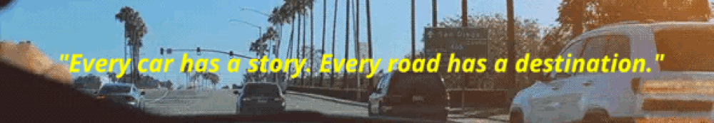

## 😎 About Me

Hello! I’m **SEOHEE KIM (ARIELLE)**, a graduate with a degree in Software and Artificial Intelligence (SW/AI) from South Korea 🇰🇷. 
I am working towards becoming an **Autonomous Driving Software Engineer**, with a particular focus on **in-vehicle communication systems** for autonomous vehicles.

## 🔧 Technology Stack

### Programming Languages and Libraries

    
    
    

### Development Tools

    
    
    
    
    

### Data Formats & Middleware

    

## 🏗️ Projects

- **GDSC HUFS Solution Challenge** (December 2022 - March 2023)
- **Parking space detection using image processing and object recognition** (August 20, 2024 - September 9)
- **Predictive Pedestrian Detection in Autonomous Driving Using Traditional Korean Mask Dance (Talchum) Motion Data** (Big Data_2024_2nd_Semester)

## 📚 Learning Journey

- **SW/AI Major** at Hankuk University of Foreign Studies (Expected to graduate in February 2025)
- **GDSC_HUFS Team Member** (2022 - 2023)
  - Collaborated with team members on various projects and events related to Google technologies(Kotlin, Tensorflow).
- **Autonomous Driving Track** (Elice, 1st Period, July 2024)  

## 💼 Experience

- **Digital Export Support Center Operation Project** at NIPA (June 24, 2022 - December 30, 2022)
  - Conducted ICT support platform management, marketing, data collection, report creation, and translation/interpretation tasks.

## 🏎️ Interests and Hobbies

    

I have a strong interest in automotive technologies, especially in the areas of **vehicle dynamics modeling** and **F1 motorsports engineering**. 

Understanding the limits of vehicle performance and the principles of precise control in motorsports inspires my approach to autonomous driving development. I believe that insights from high-performance racing can lead to safer, more reliable autonomous systems.

- **Vehicle Dynamics**: Studying physical behavior and control models to enhance autonomous driving performance.
- **F1 Engineering**: Learning from aerodynamic design, tire behavior, and advanced control strategies to apply them in real-world mobility solutions.

## 🌐 Contact

    
    
    

- **Email**: [seohee70428@gmail.com]
- **LinkedIn**: [https://www.linkedin.com/in/seohee-kim-12ab1b316/]
- **Blog**: [https://arielle0222.github.io/]
