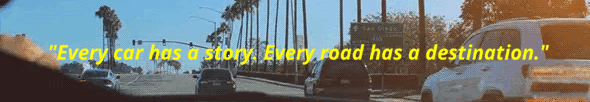

## 😎 About Me

Hello! I’m **SEOHEE KIM(ARIELLE)**, a student majoring in Software and Artificial Intelligence (SW/AI) in Republic of Korea.🇰🇷 I am dedicated to becoming a **Machine Learning Engineer** specializing in **End-to-End Driving** solutions for autonomous vehicles. This GitHub page showcases my learning journey, ongoing projects, and the technology stack I am working with.

## 🚀 Objective

My goal is to contribute to a future where **software-driven automobiles offer seamless mobility and ensure free from accidents**. By designing and implementing advanced machine learning models for autonomous driving systems, I aim to create a future where everyone can move without worry. 

I am focusing on an **End-to-End Driving** approach to tackle the complex challenges in autonomous driving technology. While I may not possess extraordinary talents, I am committed to taking on challenges without hesitation. I believe that courage and determination are key to driving innovation and achieving impactful results in the field of autonomous vehicles.

## 🔧 Technology Stack

### Programming Languages and Libraries

    
    
    
    
    
    

### Development Tools

    
    
    
    
    
    

### Data Formats & Middleware

    
    

## 🏗️ Ongoing Projects

## 🛠️ Projects and Code

## 📚 Learning Journey

- **SW/AI Major** at Hankuk University of Foreign Studies (Expected to graduate in February 2025)
- **Online Courses**: 
  - **Autonomous Driving** [Elice Track, 1st period] (July 2024 - Present)
  - **CAN Communication(Controller Area Network)** [Inflearn]

## 💼 Experience

- **Digital Export Support Center Operation Project** at NIPA (June 24, 2022 - December 30, 2022)
  - Conducted ICT support platform management, marketing, data collection, report creation, and translation/interpretation tasks.
- **GDSC_HUFS Team Member** (2022 - 2023)
  - Collaborated with team members on various projects and events related to Google technologies(Kotlin, Tensorflow).

## 🏎️ Interests and Hobbies

    

I have a deep passion for automotive and autonomous driving technology, with a particular interest in vehicle dynamics models and F1 motorsports engineering. F1 motorsports presents a technical challenge of pushing vehicle performance to the limit, and I dedicate significant time to studying and researching precise modeling and simulation needed to optimize vehicle dynamics and maintain stability at high speeds.

- **Vehicle Dynamics**: I focus on understanding the physical movement and interactions of vehicles through dynamic models, aiming to enhance the performance of autonomous driving systems.
- **F1 Motorsports**: I study advanced technologies, aerodynamic design, tire performance, and strategic driving techniques in F1 vehicles, gaining insights to improve engineering in autonomous vehicles.

## 🌐 Contact

    
    
    

- **Email**: [seohee70428@gmail.com]
- **LinkedIn**: [https://www.linkedin.com/in/seohee-kim-12ab1b316/]
- **Blog**: [https://arielle0222.github.io/]
